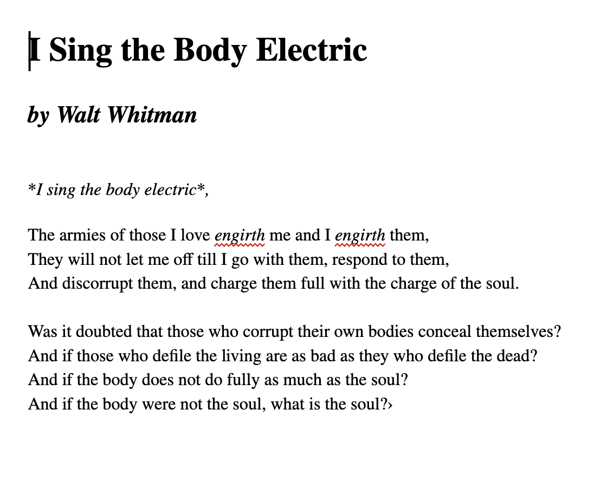
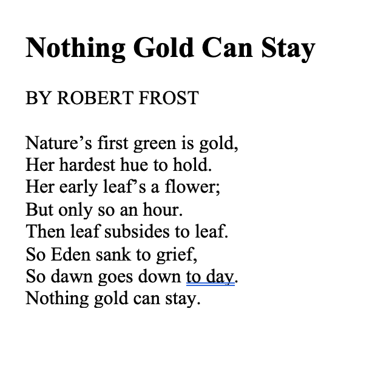

# Structure of a Webpage

HTML files use a particular structure.  There are certain elements must be included before you start creating a webpage.

You should already see ```<!DOCTYPE html>``` on your webpage.

When you visit a website, this  line of code tells the browser that document being rendered or shown is an HTML file.

## Task 1

Place your cursor underneath ```<!DOCTYPE html>``` and press the space bar twice. Add the tag ```<HTML>```. Replit should automatically  create a closing tag for you. Tap RETURN to put the closing tag on another line.

Notice that the cursor is indented in between the ```<HTML>``` tags. Whenever a tag is **NESTED** inside another tag, **always indent by pressing the space bar twice!** This is proper HTML 'grammar'.

```<HTML>``` This indicates the beginning and end of Your html code. **Never write any code outside of these tags!!** It will still work in the Replit environment, but if you try to deploy your website (upload it to a server), it may not display properly.

## Task 2

Inside the ```<HTML>``` tags, add the tag ```<head>```. Press return to put the closing ```</head>``` tag on another line.

```<head>``` The “Head” tags contains metadata (data about data) like document title, styles, scripts (and other things we will learn more about later.)

## Task 3

Inside the ```<head>``` tgs, add the tag ```<title>```.  Inside the ```<title>``` tags, add the content 'My First webpage'. (You don't have to press the space bar), it should look like this:

```<title>My First Webpage</title>```

```<title>``` The <title> tags displays a title at top of the browser window.  It also appears as a result of a search engine query (in other words, a Google search).

## Task 4

Place the cursor underneath the **closing** ```</head>``` tag. Add the tag  ```<body>```.  **Make sure your body tags ARE NOT nested in the head tags!**  They should be nested in the HTML tags only. They should be indented evenly with the head tags.

The ```<body>``` element contains anything that will be shown inside the main browser window.  **All content that will be seen in a web browser must be in between the ```body``` element only!** This is where you will create your webpage.

Now that you've set up your webpage, let's add some content.

# HTML Review

This is an  HTML **element**:

```<p>Hello World</p>```

An HTML **element** consists of an opening tag ```<p>``` that tells the computer how to display the content. The content that will displayed on screen ```Hello World``` and a closing tag ```</p>```

### Common Tags

```<p>``` stands for Paragraph.
```<h1>``` is a heading. It is bigger and bolder than a paragraph.

### Nested Elements

An element can include multiple tags. The content between two tags will display both the appearance of both tags. Example:

```<h1><i>Hello World</i></h1>```

```<h1>``` is heading and ```<i>``` is italic. The content will display as a **Italicized Heading** Like this:

## ***Hello World***

### Line Breaks

You can use a ```<br>``` tag to add a line break in the middle of a paragraph  or heading. You do not have to close a ```<br>``` tag. When ever you want to start a new line, add a ```<br>``` tag. Example:

This displays as one line:

```<p>The White House 1600 Pennsylvania Avenue NW, Washington, DC 20500</p>```

**Like this:**

The White House 1600 Pennsylvania Avenue NW, Washington, DC 20500


Adding a ```<br>``` tag will start a new lines:

```<p>The White House<br> 1600 Pennsylvania Avenue NW,<br> Washington, DC 20500</p>```

**Like this:**

The White House
1600 Pennsylvania Avenue NW,
Washington, DC 20500


## Lesson Activity 

**Copy and paste the poem in between the body tags:**

```

I Sing the Body Electric

by Walt Whitman


I sing the body electric,

The armies of those I love engirth me and I engirth them,
They will not let me off till I go with them, respond to them,
And discorrupt them, and charge them full with the charge of the soul.

Was it doubted that those who corrupt their own bodies conceal themselves?
And if those who defile the living are as bad as they who defile the dead?
And if the body does not do fully as much as the soul?
And if the body were not the soul, what is the soul?
```

Now look at this image of the poem:



Using Heading and Paragraph tags and nested italic tags, recreate the appearance of the poem, as close as you can, on your HTML page. Notice how the title is bigger than the author credit and both the title and author credit are bigger and bolder than the text of the poem.  Also notice how the first line of the poem is italicized.

## Lesson Activity 2


**Copy and paste the poem in between the body tags:**

```
Nothing Gold Can Stay

BY ROBERT FROST

Nature’s first green is gold,
Her hardest hue to hold.
Her early leaf’s a flower;
But only so an hour.
Then leaf subsides to leaf.
So Eden sank to grief,
So dawn goes down to day.
Nothing gold can stay.```
```
Now look at the image below:




Using Heading, Paragraph and Line Break tags, recreate the appearance of the poem, as close as you can, on your HTML page.